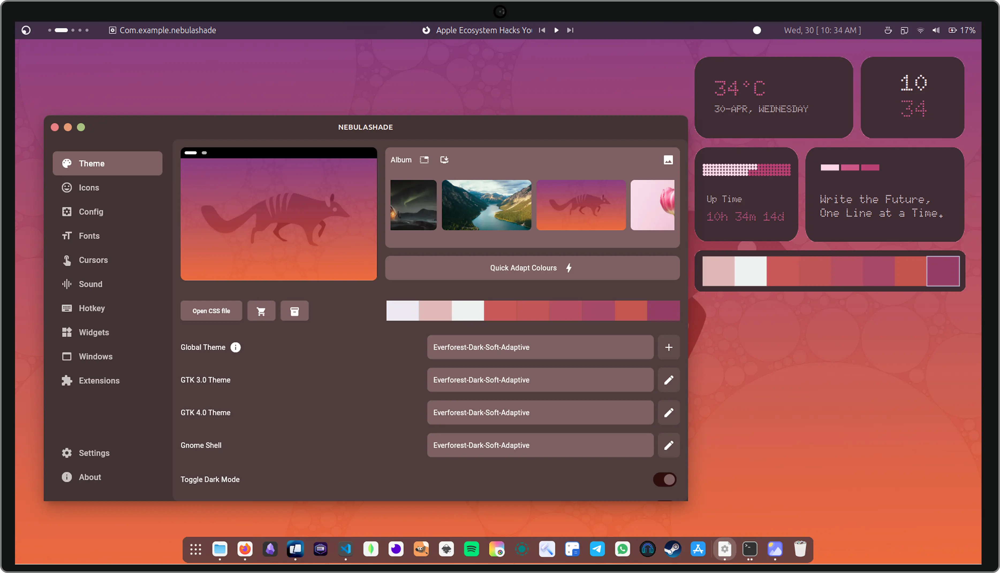
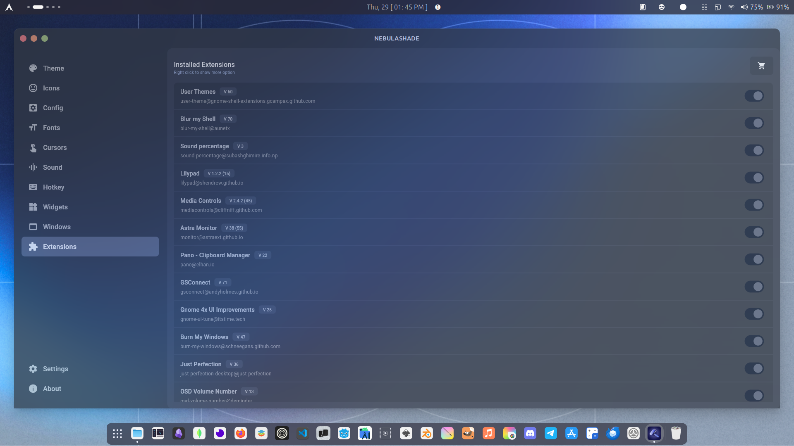
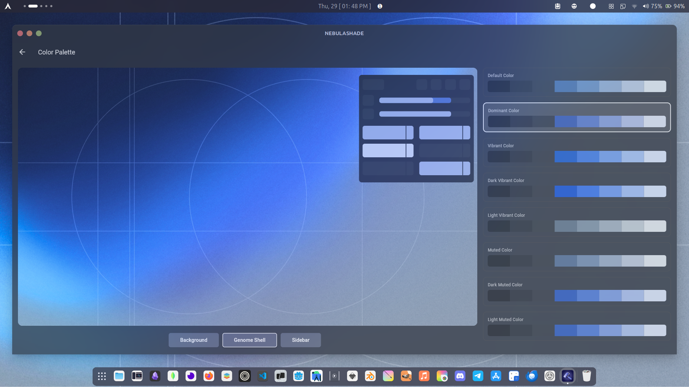
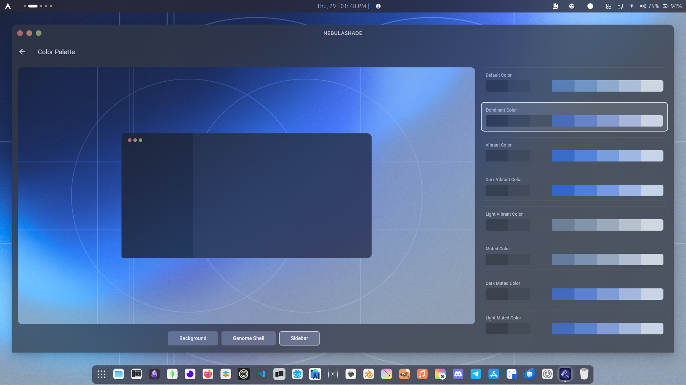
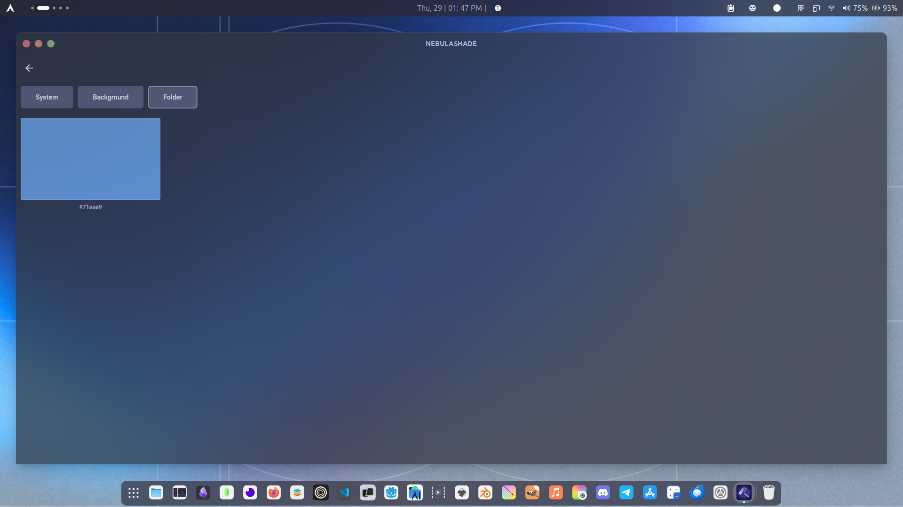

<div align="center">
   <picture>
      
   </picture>
   <h2>NebulaShade</h2>
</div>
<div align="center">


| Advanced Linux Customization Suite |
|-----------------------------------------|
</div>


**NebulaShade** is a modern Linux customization ecosystem designed to deliver **one-click system personalization**, dynamic theming, and adaptive color generation. It transforms Linux desktops into a fully personalized, visually consistent, and automated environment through a clean UI and powerful automation backend.

> NebulaShade is not just a theme manager — it’s a **Linux personalization ecosystem**.

---

## 🚀 Vision

To create a **unified Linux customization platform** where theming, UI design, system styling, and automation work together seamlessly — enabling users to personalize their system with a single click.

---

## 🌌 Core Concept

NebulaShade acts as a **central customization layer** for Linux that provides:

* Visual theming
* System-wide personalization
* Dynamic color adaptation
* UI/UX consistency
* Automated configuration

It bridges **design + automation + system configuration** into one unified tool.

---

## 🖼️ Demo Preview

<div align="center">
  
</div>

> *Demo image showing the NebulaShade customization interface.*

---

## 📸 Screenshot Previews

<div align="center">
  
  
  <br/><br/>
  
  
</div>

---

## ✨ Key Features (Professional Overview)

NebulaShade is designed as a **production-grade Linux customization platform** that combines system automation, UI engineering, and desktop personalization into a single unified application.

It provides:

* Enterprise-level system theming
* Automated configuration pipelines
* Cross-layer UI consistency
* Scalable customization architecture
* User-centric design workflows

---

## 🧩 Customization Modules (All Options)

### 🎨 Theme Management

* Global system themes
* GTK 3 / GTK 4 themes
* GNOME Shell themes
* Dark/Light mode toggle
* Adaptive themes
* Per-app theming

### 🖼 Icons

* System icon packs
* App icon customization
* Adaptive icon mapping
* Cross-theme icon compatibility

### ⚙️ Config

* System configuration profiles
* Preset configurations
* Environment-based configs
* Profile switching

### 🔤 Fonts

* Global font control
* App-level fonts
* UI fonts
* Developer fonts
* Rendering optimization

### 🖱 Cursors

* Cursor theme management
* DPI scaling
* Accessibility cursors

### 🔊 Sound

* System sound themes
* Notification sounds
* UI interaction sounds
* Profile-based sound configs

### ⌨️ Hotkeys

* Global shortcuts
* Custom key bindings
* Workflow automation shortcuts
* Productivity mappings

### 🧱 Widgets

* Desktop widgets
* System monitors
* Productivity widgets
* Custom widget modules

### 🪟 Windows

* Window manager configs
* Animation settings
* Layout controls
* Workspace management

### 🧩 Extensions

* GNOME extensions management
* Extension automation
* Extension profiles
* Compatibility handling

### ⚙️ Settings

* Global system settings
* User preferences
* Performance tuning
* Resource optimization

### ℹ️ About

* System metadata
* Versioning
* Build information
* Platform diagnostics

---

* 🎨 **One-Click System Personalization**
  Apply complete system themes instantly

* 🌈 **Dynamic Color Palette Generation**
  Auto-generate adaptive color schemes

* 🧠 **Smart Theme Adaptation**
  UI adapts based on wallpaper and system colors

* 🖥️ **GNOME Integration**
  Native GNOME customization support

* ⚙️ **System Automation**
  Automated configuration using scripts

* 🧩 **Modular Customization Engine**
  Component-based personalization system

* 🧬 **Ecosystem Design**
  Unified theming across apps, shell, and system

---

## 🧠 Architecture Overview

```text
[ Flutter UI Layer ]
        │
        │
[ Customization Engine ]
        │
        │
[ Automation Layer ]
 (Python + Bash)
        │
        │
[ Linux System Layer ]
 (GNOME + System Configs)
```

---

## 🛠️ Technologies

| Layer           | Technologies           |
| --------------- | ---------------------- |
| Platform        | Linux                  |
| UI              | Flutter                |
| Desktop         | GNOME                  |
| Automation      | Python, Bash Scripting |
| Design          | UI/UX Design           |
| System Control  | Linux System APIs      |
| Personalization | Dynamic Theming Engine |

---

## 🔧 Capabilities

* Global theme management
* Icon pack control
* Font customization
* Cursor theming
* Wallpaper adaptation
* GTK theme control
* GNOME shell theming
* Accent color generation
* System UI consistency
* Script-based automation

---

## 🎯 Use Cases

* Full system theming in one click
* Developer desktop personalization
* Designer-focused Linux setups
* Automated desktop styling
* Distribution customization tools
* Personal Linux ecosystem creation

---

## 📦 Installation

```bash
# Clone repository
git clone <repo-link>
cd nebulashade

# Install dependencies
bash install.sh

# Run application
flutter run
```

---

## ▶️ Usage Flow

1. Launch NebulaShade
2. Select personalization mode
3. Choose theme or wallpaper
4. Generate dynamic palette
5. Apply system customization
6. System updates automatically

---

## 🧭 Project Positioning

NebulaShade functions as a:

* 🎨 **Linux Personalization Engine**
* 🌌 **Customization Ecosystem**
* 🧠 **System Styling Layer**
* ⚙️ **Automation Platform**
* 🖥️ **Desktop Experience Manager**

---

## 🤝 Contributing

1. Fork the repository
2. Create a branch

   ```bash
   git checkout -b feature-name
   ```
3. Commit changes

   ```bash
   git commit -m "Add feature"
   ```
4. Push branch

   ```bash
   git push origin feature-name
   ```
5. Open Pull Request

---

## 📄 License

MIT License

---


> NebulaShade is a complete Linux personalization ecosystem — where design meets automation.
