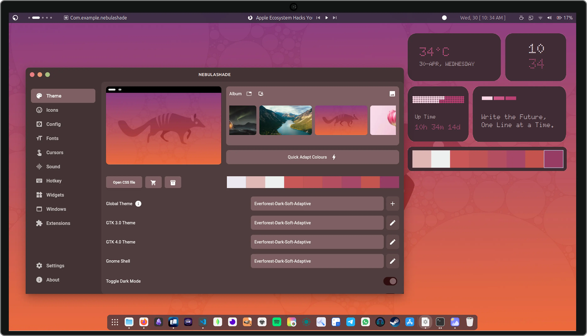

> **🚧 Maintenance Mode — Not yet ready for public release. Active development in progress.**

<div align="center">
   <picture>
      
   </picture>
   <h2>NebulaShade</h2>
</div>
<div align="center">


| **Dynamic GNOME Desktop** | **System-Wide Global Themeing** | **Polished User Experience** |
|:---:|:---:|:---:|

</div>

---

**NebulaShade** is a powerful Linux customization engine designed to bring harmony to your workspace. By dynamically extracting color palettes from your wallpaper, it applies a cohesive, global theme across your entire desktop environment. Built for the modern Linux user, it bridges the gap between static configurations and a truly personalized, living OS.

> **NebulaShade:** Because your desktop should be as dynamic as your inspiration.

### 🌟 Key Highlights

* **🎨 Dynamic Color Sync:** Your system accents evolve automatically with your wallpaper.
* **🌍 System-Wide Integration:** Applies themes to GNOME Shell, GTK4/3, and terminal emulators.
* **🏪 Nebula Marketplace:** A community-driven hub to discover, download, and share custom presets.
* **🎛 Granular Control:** Fully adjustable parameters for users who want to fine-tune every hex code.


---

## Screenshots Preview

<div align="center">
  
</div>

> *Demo image showing the NebulaShade customization interface.*

## ✨ What is NebulaShade?

NebulaShade brings **intelligent, wallpaper-aware theming** to Linux. Set a wallpaper, and NebulaShade automatically derives a cohesive color palette from it — propagating that palette across your GTK apps, GNOME Shell, icon packs, file manager icons, desktop widgets, and more.

Think of it as **Material You for Linux** — but deeper, more customizable, and designed for power users who care about every pixel of their desktop.

> ✅ Tested on **Everforest** theme + **Colloid** icon pack — full compatibility confirmed.

---

## 🚀 Core Features

### Dynamic Wallpaper-Driven Theming
Set a wallpaper. NebulaShade does the rest.  
Colors are extracted from your wallpaper and applied globally — across GTK apps, the GNOME Shell, notification panel, settings pages, and more. No manual tweaking. Just a living, breathing desktop that always feels coherent.

### File Manager Icon Theming
NebulaShade goes beyond apps. It recolors **file icons inside the native file manager** to match your current wallpaper palette — so even your filesystem feels like part of the design system.

### Custom Desktop Widgets
A built-in widget layer for your desktop, including:
- **Conky setter** — configure and apply Conky widgets with a single click
- **ucon key setter** — manage icon key bindings visually
- One-click apply — go from a bland desktop to a polished, professional setup instantly

### 🛍️ Built-in Marketplace
Browse and install from a curated marketplace directly inside NebulaShade:
- **Icon packs**
- **Cursor themes**
- **GTK / Shell themes**
- **Gnome Extension**

Everything managed in one place. No hunting through external sites.

### 🧩 Unified Theme Manager
NebulaShade is the single control panel for your entire desktop aesthetic:
- Switch themes, icon packs, cursors, and wallpapers
- Preview changes before applying
- Manage installed assets in one unified interface

---

## 🛠️ Tech Stack

| Layer | Technology |
|---|---|
| UI Framework | Flutter / Dart |
| Desktop Target | GNOME (Wayland) |
| Theme Engine | GTK3 / GTK4 |
| Shell Integration | GNOME Shell / GSettings |
| Widget Layer | Conky |
| Icon Protocol | Freedesktop Icon Spec |

---

## 📦 Installation

> ⚠️ **NebulaShade is not yet released.** Installation instructions will be published here upon first stable release.

If you'd like to build from source for development/testing:

```bash
# Clone the repository
git clone https://github.com/smrutiprakashrout/NebulaShade.git
cd NebulaShade

# Install Flutter dependencies
flutter pub get

# Run on Linux desktop
flutter run -d linux
```

> **Requirements:** Flutter 3.x+, GNOME desktop, GTK 3/4

---

## 🗺️ Roadmap

- [x] Wallpaper color extraction engine
- [x] GTK app theming pipeline
- [x] GNOME Shell background theming
- [x] File manager icon recoloring
- [x] Everforest + Colloid icon pack support
- [x] Accent color derivation from vibrant hue clusters
- [x] GTK sidebar / main area color consistency
- [ ] Marketplace (icons, cursors, themes)
- [ ] Desktop widget layer (Conky + ucon)
- [ ] One-click desktop profile apply
- [ ] Public v1.0 release

---

## 🤝 Contributing

NebulaShade is **not accepting external contributions yet** while core architecture is being finalized.  
Once the project reaches a stable foundation, contribution guidelines will be published.  

**Star the repo** to get notified when it opens up. ⭐

---

## 🧑‍💻 Author

**Smruti Prakash Rout**  🇮🇳
Full-stack developer · Systems & Network Adminstater · Devops Engineer

[](https://github.com/smrutiprakashrout)

---

## 📄 License

MIT License — see [LICENSE](./LICENSE) for details.

---

<p align="center">
  <sub>Built with 💙 for the Linux desktop community</sub>
</p>
